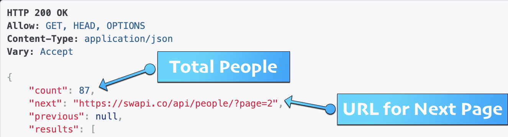

# Data Acquisition, Search, and Discovery

## Chapter
Forthcoming

## Lecture
Forthcoming

## Exercise
Our exercise this week focuses on exploring the concept of an API. This exercise was developed by the estimable data scientist [Bree Norlander](https://tascha.uw.edu/people/bree-norlander/)

#### How to use an API (And what is it anyway?)
API is the acronym for Application Programming Interface. An API does the work of retrieving data in a variety of forms from its original home to a source that is requesting that data using a specific set of rules. The source may be you making a request through the web or it may be a mobile app retrieving map data from Google. A search for What is an API will result in many great tutorials. I found a quick 3-minute video that covers this topic well and will prepare you for the remainder of the tutorial. Note, this video is put out by a company but I do not mean it as an endorsement for the company, I just like their concise description. Let’s take a look...

<iframe width=853 height=477 frameborder="0" scrolling="no" src="https://youtu.be/s7wmiS2mSXY?t=3" allowfullscreen="true"></iframe>

So why should a data curator be interested in APIs? An API is a common tool for retrieving data.


APIs provide the messenger service you need to collect data from sites like [Twitter](https://developer.twitter.com/en/docs/api-reference-index), [MySportsFeeds](https://www.mysportsfeeds.com/data-feeds/), [RottenTomatoes](https://developer.fandango.com/rotten_tomatoes), [Twitch](https://dev.twitch.tv/docs/api/), and more. Most of these sites will require you to apply for an API key and may have restrictions on the use of their data. For example, RottenTomatoes, states “Please note that at this time we no longer support unauthorized use of our data (e.g. unofficial projects, non-user facing data integrations).”

If you are interested in working with data, whether it be as a Data Curator, a Government Docs Librarian, or a Data Scientist, it will benefit you to be familiar with APIs.

As is the case with repositories, data portals, and an email from your boss, data retrieved from an API may be presented in a variety of different formats. When you use a "web service" API you will mainly see outputs in the form of eXtensible Markup Language known as XML, JavaScript Object Notation known as JSON (or geoJSON for geographic data), or Comma Separated Values known as CSV. A **web service** as a "[system or software that uses an address, i.e., URL on the World Wide Web, to provide access to its services](https://rapidapi.com/blog/types-of-apis/)". This means that the API output can be viewed directly in a web browser. The three most common types of web service APIs are:
+ simple object access protocol or SOAP which returns an XML object
+ remote procedural call R.P.C. which returns either an XML or JSON object depending on which format they're using (XML-RPC or JSON-RPC)
+ and the most common right now is REpresentational State Transfer or REST which is not a protocol but rather a set of architectural principles ([read](https://www.ics.uci.edu/~fielding/pubs/dissertation/top.htm) the dissertation that coined the phrase)

REST services tend to offer an easy to parse URL structure consisting primarily of nouns that reflect the logical hierarchical categories of the data on offer. I will show you an example of what that means below. REST APIs usually return JSON or XML but can sometimes also return different formats such as CSV.


#### Simple REST Example

Let’s take a look at a simple REST API example. This API is from Paul Hallet and is called [SWAPI](https://swapi/co): The Star Wars API. Paul [writes](https://swapi.co/about), "After hours of watching films and trawling through content online, we present to you all the People, Films, Species, Starships, Vehicles and Planets from Star Wars." SWAPI is built just to be an API, while other web applications may use the data, this API wasn't built with any particular application in mind. I did some searching of the backend of website (hosted on [Github](https://github.com/phalt/swapi/)) and found that the data are available in six JSON files: films.json, people.json, planets.json, species.json, starships.json, and vehicles.json. You'll note that these files match with Paul's list of datasets in the quote above. In [REST naming conventions](https://restfulapi.net/resource-naming/), these datasets are referred to as "Resources" and as we see here, should be a noun indicating what is within the Resource. The SWAPI API, because it's built using a REST architecture, allows us to view the output from our API query directly in the browser. Let’s check out the People data. 

The [SWAPI documentation](https://swapi.co/documentation#people) tells us that queries within the People Resource will result in the following "Attributes":


It also notes that searches will only happen with the Name attribute field. 

The highest level search we can do within the People Resource is also the URL with which we will begin our queries: [`https://swapi.co/api/people/`](https://swapi.co/api/people/). You can go directly to that URL in your broswer to see the first 10 data entries in the People Resource. This API requires you to paginate through the entries in intervals of 10. Fortunately, it tells you exactly how many entries there are and what the API query will be for the next page:



The pagination system is not ideal and makes it more tedious to grab all the data in the People dataset. I don't think it's common to see it set up this way. Let's try a query for Name in the People Resource. We need to follow the REST rules for querying.

According to the documentation, in order to search within a Resource, we need to append:
```
/?search=<search term>
```
to the base URL. (Note that you will not need the brackets when you add your search term.)


So try out a search in the People Resource for "Luke". Your URL should look like: [`https://swapi.co/api/people/?search=Luke`](https://swapi.co/api/people/?search=Luke). You can further refine you search by adding an ampersand (&) and a second query. For example, you can designate a data format (which the documentation calls "encoding"). With this simple API example, your choices are very limited: JSON (which is the default) or wookie. Sadly at the time of this writing, wookie is throwing an "unexpected character error" so just go ahead and try adding JSON format to the last query: [`https://swapi.co/api/people/?search=Luke&format=JSON`](https://swapi.co/api/people/?search=Luke&format=JSON). (Note you do not need to repeat the question mark for the second query.)

This is a simple example of the concept discussed above that REST services tend to offer an easy to parse URL structure consisting primarily of nouns that reflect the logical hierarchical categories of the data being offered.

#### JSON Parser with API

With the previous example, you may have wondered what to do with the JSON output. We often interact with data in a tabular format when we use products like Microsoft Excel, Google Sheets, and even R and Python. So let's look at another rest API example and use a JSON editor to make it easier to parse the JSON. 

I discovered this interesting [API](http://poetrydb.org/index.html) that retrieves data from a poetry database. I like this example because it provides an example of digital humanities data. Click on [Learn More](https://github.com/thundercomb/poetrydb/blob/master/README.md) from the [homepage](http://poetrydb.org/index.html). This brings us to the Github repository hosting the API. The first thing you see is README document with instructions on how to structure the URL in order to retrieve the data you’re interested in. Let's start with the first example on the page. [`http://poetrydb.org/title/Ozymandias/lines.json`](http://poetrydb.org/title/Ozymandias/lines.json) This URL is structured to return the lines of a given poem based on its title. However, I want more than just the lines of data. So with further reading in the README documentation I found that I could just remove the “lines” text from the URL to retrieve more data about the poem. [`http://poetrydb.org/title/Ozymandias/.json`](http://poetrydb.org/title/Ozymandias/.json) If you copy/paste this URL into a Firefox browser window, you'll see that Firefox automatically provided a simple layout for navigating the JSON and even an option for saving, copying, and filtering the data. This won’t be the case with all browsers and sometimes you will simply get the raw output as you can see here:


If this output were considerably longer and contained more nested arrays, it would be easy to get lost in the data. So let's use a helpful tool called [JSON Formatter](https://jsonformatter.org/), one of many JSON parsers. Click on the Upload Data button in the center of the screen and paste in a URL. Let's try data about poems by author Bronte using this URL: [`http://poetrydb.org/author/Bronte`](http://poetrydb.org/author/Bronte). 


The JSON Formatter allows you to sort data, filter, format, convert, and download data in alternate formats. If you want to use the data within Google Sheets for example, you can convert to csv, download the data, and open in Google Sheets.

#### Programmatic Access to APIs
While the above techniques work well for small datasets, if you want to access large datasets and/or want to wrangle and analyze the data, you can access APIs programmatically. You can access data through Python, R, Javascript, a command line terminal, and more. There are even proprietary software platforms for interacting with APIs. The video below shows a very quick example of accessing Tweets via the Twitter API using a Python script:

<iframe width=853 height=477 frameborder="0" scrolling="no" src="https://youtu.be/RY7q3MpRN3s" allowfullscreen="true"></iframe>

My goal in this tutorial was to introduce you to APIs and how you can start using them today. While some APIs will require a coding background, many do not. I hope you will feel comfortable testing out different APIs and gathering data from sources of interest. As you experiement with gathering data via an API, be sure to look at the documentation for that API. Most documentation will give you all the information you need to format the query just the way you want it.

#### Using the Socrata API to Access WA State Data
In this demonstration and exercise, we'll look at the [State of Washington's data portal](https://data.wa.gov/), which is built on a [Socrata](https://www.tylertech.com/products/socrata/data-platform) platform. Socrata has created a custom API called SODA (Socrata Open Data API) which is very similar to a REST API. They also have a custom query language called SoQL or “Socrata Query Language”. It will be important to refer to the [SODA API Documentation](https://dev.socrata.com/consumers/getting-started.html) throughout this demonstration.

Start by visiting the state data portal homepage at [https://data.wa.gov/](https://data.wa.gov/). There are actually several different portals listed here on the homepage. For this demo we are going to look specifically at the Socrata platform which can be accessed by clicking on "Data Catalog."


Here you will see everything available on the data catalog, from datasets, to maps, to filtered views, and more. We will specifically be looking at Datasets. So go ahead and filter your view to just Datasets by clicking "Datasets" in the View Types of the faceted search interface on the left of the screen. Here you see all of the datasets hosted on the state data portal. Let's take a look at a specific example. Search for "Cleanup Sites in Washington State" and filter again to Datasets. We're looking for the dataset with that specific title, which you should be able to find [here](https://data.wa.gov/Natural-Resources-Environment/Cleanup-Sites-in-Washington-State/vtkh-65is).


Take some time to familiarize yourself with what is available on this page including metadata, data preview, and content made with this data. When you have an idea of the data that's available in the dataset, click the API link near the top of the page.


If you click "Copy" on the API endpoint and paste this URL into a browser window, you will see all the data. Depending on which brower you use, you may see this JSON file formatted in an easy to navigate format or a raw textual format. This is nice, but we could have just exported the data and viewed it in our preferred software. The API endpoint is an easy way to import data programatically into data analysis tools such as Tableau and R. But you can also use to API to filter the data to exactly what you need, to avoid downloading or importing files that are too large. So we have the api endpoint URL [`https://data.wa.gov/resource/vtkh-65is.json`](https://data.wa.gov/resource/vtkh-65is.json), let's figure out how to filter the data to see only sites which are in King County.

If you look at the data portal page again, you will see that there is a list of all the columns in the dataset. One of the columns is "County Name." Click on the arrow to the right of "County Name":


You can now see that the data type for this colummn is "Text" and the API Field Name is "county_name". This API field name is what you'll need for doing a filtered API call. To figure out the structure of our filtered API call, let's refer to the SODA API Documentation, specifically the [Getting Started](https://dev.socrata.com/consumers/getting-started.html) chapter. If you scroll down (or better yet read through) to the "Building simple filters and queries" section, the first example for a simple filters will give us the information we need.


You can see by this example, that the beginning of the query (the api endpoint) is the same as what we used above: [`https://data.wa.gov/resource/vtkh-65is.json`](https://data.wa.gov/resource/vtkh-65is.json). The next step to adding a query to the URL is to add a question mark. This is also a common method for querying REST APIs. Following the question mark you need to specify the attribute/field/column, and we already found out above that the API Field Name we are looking for is "county_name". Finally, we are looking for an exact match so we can use the equals sign following by th estring we want to match, "King" (but note you do not want to enclose the string in quotations marks or apostrophes - this is different than how you deal with strings in many programming languages). So our final URL looks like: [`https://data.wa.gov/resource/vtkh-65is.json?county_name=King`](https://data.wa.gov/resource/vtkh-65is.json?county_name=King).

This should get you started on making filtered query API calls. Notice in the screenshot above that there is considerably more documentation on filtering datasets. This example is the tip of the iceberg in what you can do. With SODA it's easy to experiment with different queries directly in your brower window. Here are a couple of things to notice about our example and perhaps you can dig into the documentation to figure out workarounds to the problems that will arise here:

- What happens when you create the filtered query but don't capitalize the 'K' in King?
- What happens when you replace 'json' with 'csv'?


## Reading
Forthcoming 