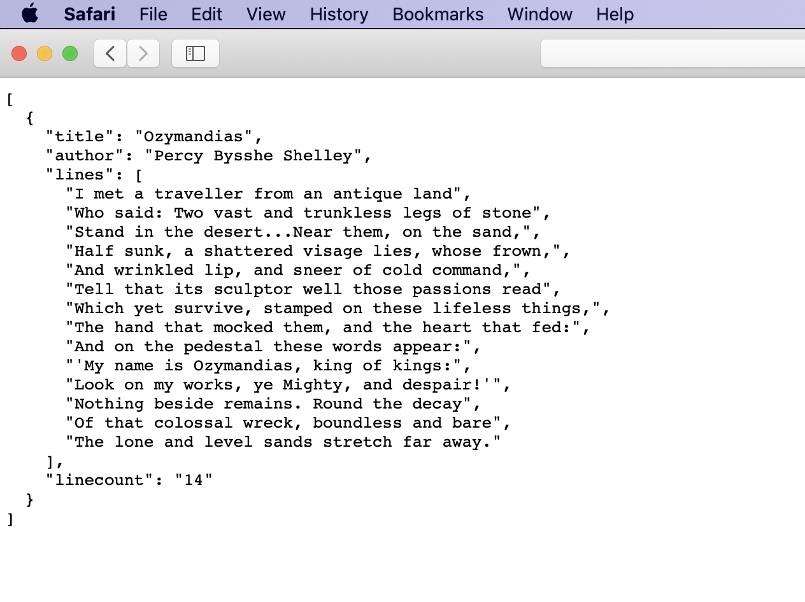

# Data Acquisition, Search, and Discovery

## Chapter
Forthcoming

## Lecture
Forthcoming

## Exercise
Our exercise this week focuses on exploring the concept of an API. This exercise was developed by the estimable data scientist [Bree Norlander](https://tascha.uw.edu/people/bree-norlander/)

#### How to use an API (And what is it anyway?)
API is the acronym for Application Programming Interface. An API does the work of retrieving data in a variety of forms from its original home to a source that is requesting that data using a specific set of formal methods or rules. The source may be you making a request through the web or it may be a mobile app retrieving map data from Google. A search for What is an API will result in many great tutorials. I found a quick 3-minute video that covers this topic well and will prepare you for the remainder of the tutorial. Note, this video is put out by a company but I do not mean it as an endorsement for the company, I just like their concise description. Let’s take a look...

[](//youtu.be/s7wmiS2mSXY?t=3 "What is an API?")

So why should a data curator be interested in APIs? An API is a common tool for retrieving data. 

**Why APIs Matter** 

APIs provide the messenger service you need to collect data from sites like [Twitter](https://developer.twitter.com/en/docs/api-reference-index), [MySportsFeeds](https://www.mysportsfeeds.com/data-feeds/), [RottenTomatoes](https://developer.fandango.com/rotten_tomatoes), [Twitch](https://dev.twitch.tv/docs/api/), and more. Most of these sites will require you to apply for an API key and may have restrictions on the use of their data. For example, RottenTomatoes, states “Please note that at this time we no longer support unauthorized use of our data (e.g. unofficial projects, non-user facing data integrations).”

If you are interested in working with data, whether it be as a Data Curator, a Government Docs Librarian, or a Data Scientist, it will benefit you to be familiar with APIs. The following are use cases for which you may find yourself using an API:

+ Accessing/retrieving a specific dataset 
+ Retrieving a filtered dataset from a large dataset (perhaps you only need data for your specific state in a dataset that contains naionwide data)
+ Searching for specific data within a dataset (e.g. does this dataset contain data from my zip code or what are the unique values within a specific column)
+ Performing simple calculations or summaries on a dataset directly within your browser (no need to download the data and use another software platform)

As is the case with repositories, data portals, and an email from your boss, data retrieved from an API may be presented in a variety of different formats. When you use a "web service" API you will mainly see outputs in the form of eXtensible Markup Language known as XML, JavaScript Object Notation known as JSON (or geoJSON for geographic data), or Comma Separated Values known as CSV. 

A **web service** is a "[system or software that uses an address, i.e., URL on the World Wide Web, to provide access to its services](https://rapidapi.com/blog/types-of-apis/)". This means that the API output can be viewed directly in a web browser. The three most common types of web service APIs are:

+ Simple object access protocol or SOAP which returns an XML object
+ Remote procedural call R.P.C. which returns either an XML or JSON object depending on which format they're using (XML-RPC or JSON-RPC)
+ and the most common right now is REpresentational State Transfer or REST which is not a protocol but rather a set of architectural principles ([read](https://www.ics.uci.edu/~fielding/pubs/dissertation/top.htm) the dissertation that coined the phrase)

REST services tend to offer an easy to parse URL structure consisting primarily of nouns that reflect the logical hierarchical categories of the data on offer. I will show you an example of what that means below. REST APIs usually return JSON or XML but can sometimes also return different formats such as CSV.


### Simple REST Example

Let’s take a look at a simple REST API example. This API is from Paul Hallet and is called [SWAPI](https://swapi.dev): The Star Wars API. Paul [writes](https://swapi.dev/about), "After hours of watching films and trawling through content online, we present to you all the People, Films, Species, Starships, Vehicles and Planets from Star Wars." SWAPI is built just to be an API, while other web applications may use the data, this API wasn't built with any particular application in mind. I did some searching of the backend of website (hosted on [Github](https://github.com/phalt/swapi/)) and found that the data are available in six JSON files: films.json, people.json, planets.json, species.json, starships.json, and vehicles.json. You'll note that these files match with Paul's list of datasets in the quote above. In [REST naming conventions](https://restfulapi.net/resource-naming/), these datasets are referred to as "Resources" and as we see here, should be a noun indicating what is within the Resource. The SWAPI API, because it's built using a REST architecture, allows us to view the output from our API query directly in the browser. Let’s check out the People data. 

The [SWAPI documentation](https://swapi.dev/documentation#people) tells us that queries within the People Resource will result in the following "Attributes":


It also notes that searches will only happen with the Name attribute field. 

The highest level search we can do within the People Resource is also the URL with which we will begin our queries: [`https://swapi.dev/api/people/`](https://swapi.dev/api/people/). You can go directly to that URL in your broswer to see the first 10 data entries in the People Resource. This API requires you to paginate through the entries in intervals of 10. Fortunately, it tells you exactly how many entries there are and what the API query will be for the next page:


The pagination system is not ideal and makes it more tedious to grab all the data in the People dataset. It's not common to see it set up this way for such a small dataset, but you can imagine with a very large dataset this might be necessary to reduce the call time. Let's try a query for Name in the People Resource. We need to follow the REST rules for querying.

According to the documentation, in order to search within a Resource, we need to append:
```
/?search=<search term>
```
to the base URL. (Note that you will not need the brackets when you add your search term.)


So try out a search in the People Resource for "Luke". Your URL should look like: [`https://swapi.dev/api/people/?search=Luke`](https://swapi.dev/api/people/?search=Luke). You can further refine you search by adding an ampersand (&) and a second query. For example, you can designate a data format (which the documentation calls "encoding"). ~~With this simple API example, your choices are very limited: JSON (which is the default) or wookie. Sadly at the time of this writing, wookie is throwing an "unexpected character error" so just go ahead and try adding JSON format to the last query: [`https://swapi.dev/api/people/?search=Luke&format=JSON`](https://swapi.dev/api/people/?search=Luke&format=JSON). (Note you do not need to repeat the question mark for the second query.)~~ (As of the updating of this tutorial - these choices were non-functional.)

This is a simple example of the concept discussed above that REST services tend to offer an easy to parse URL structure consisting primarily of nouns that reflect the logical hierarchical categories of the data being offered.

## JSON Parser with API

With the previous example, you may have wondered what to do with the JSON output. We often interact with data in a tabular format when we use products like Microsoft Excel, Google Sheets, and even R and Python. So let's look at another rest API example and use a JSON editor to make it easier to parse the JSON. 

I discovered this interesting [API](http://poetrydb.org/index.html) that retrieves data from a poetry database. I like this example because it provides an example of digital humanities data. Click on [Learn More](https://github.com/thundercomb/poetrydb/blob/master/README.md) from the [homepage](http://poetrydb.org/index.html). This brings us to the Github repository hosting the API. The first thing you see is README document with instructions on how to structure the URL in order to retrieve the data you’re interested in.

Let's start with the first example on the page. [`http://poetrydb.org/title/Ozymandias/lines.json`](http://poetrydb.org/title/Ozymandias/lines.json) This URL is structured to return the lines of a given poem based on its title. However, I want more than just the lines of data. So with further reading in the README documentation I found that I could just remove the “lines” text from the URL to retrieve more data about the poem. [`http://poetrydb.org/title/Ozymandias/.json`](http://poetrydb.org/title/Ozymandias/.json) If you copy/paste this URL into a Firefox browser window, you'll see that Firefox automatically provided a simple layout for navigating the JSON and even an option for saving, copying, and filtering the data. This won’t be the case with all browsers and sometimes you will simply get the raw output as you can see here:



If this output were considerably longer and contained more nested arrays, it would be easy to get lost in the data. So let's use a helpful tool called [JSON Formatter](https://jsonformatter.org/), one of many JSON parsers. Click on the Upload Data button in the center of the screen and paste in a URL. Let's try data about poems by author Bronte using this URL: [`http://poetrydb.org/author/Bronte`](http://poetrydb.org/author/Bronte). 


The JSON Formatter allows you to sort data, filter, format, convert, and download data in alternate formats. If you want to use the data within Google Sheets for example, you can convert to csv, download the data, and open in Google Sheets.

### Programmatic Access to APIs
While the above techniques work well for small datasets, if you want to access large datasets and/or want to wrangle and analyze the data, you can access APIs programmatically. You can access data through Python, R, Javascript, a command line terminal, and more. There are even proprietary software platforms for interacting with APIs. The video below shows a very quick example of accessing Tweets via the Twitter API using a Python script:

[](//youtu.be/RY7q3MpRN3s "Twitter API with Python")

My goal in this tutorial was to introduce you to APIs and how you can start using them today. While some APIs will require a coding background, many do not. I hope you will feel comfortable testing out different APIs and gathering data from sources of interest. As you experiement with gathering data via an API, be sure to look at the documentation for that API. Most documentation will give you all the information you need to format the query just the way you want it.

### Final Tip
Accessing the API documentation is the key to successfully using an API. Not all APIs are structured alike. In order to create exactly the API call you desire, you will likely employ trial and error and documentation referencing. Trial and error is how we all learn! Also, if you plan to perform the query/API call again in the future, write down how and why you can up with the query call so you don't have to start from scratch again next time!

### Additional APIs I Recommend for Practice

+ [The COVID Tracking Project](https://covidtracking.com/api)
+ [PokeAPI The RESTful Pokemon API](https://pokeapi.co/)

## Reading

This week I am going to ask you to read two things, but offer a number of other readings in this area if you are interested: 

1. Read this peice that was recently published on the development of a search infrastructure at Google: 

- Brickley, D., Burgess, M., & Noy, N. (2019, May). Google Dataset Search: Building a search engine for datasets in an open Web ecosystem. In The World Wide Web Conference (pp. 1365-1375). [PDF](https://dl.acm.org/doi/pdf/10.1145/3308558.3313685)

2. Then read these two short blog posts about when the initative started, and where it finished: 

- Noy, N et al (2017) "Facilitating the discovery of public datasets" [Link](https://ai.googleblog.com/2017/01/facilitating-discovery-of-public.html)
- Noy, N (2020) "Discovering millions of datasets on the web" [Link](https://www.blog.google/products/search/discovering-millions-datasets-web/)

Additional valuable readings on data discovery:

- Wu, M., Psomopoulos, F., Khalsa, S. J., & de Waard, A. (2019). Data Discovery Paradigms: User Requirements and Recommendations for Data Repositories. Data Science Journal, 18(1). [Link](https://datascience.codata.org/articles/10.5334/dsj-2019-003/) 
- Gregory, K. M., Cousijn, H., Groth, P., Scharnhorst, A., & Wyatt, S. (2019). Understanding data search as a socio-technical practice. Journal of Information Science, [PDF](https://journals.sagepub.com/doi/pdf/10.1177/0165551519837182) 
- Vissers, J., Van den Bosch, F., Bogaerts, A., Cocquyt, C., Degreef, J., Diagre, D., ... & Fabri, R. (2017). Scientific user requirements for a herbarium data portal. PhytoKeys, (78), 37 https://www.ncbi.nlm.nih.gov/pmc/articles/PMC5543274/ 
- Fenlon, K., Senseney, M., Green, H., Bhattacharyya, S., Willis, C., & Downie, J. S. (2014). Scholar‐built collections: A study of user requirements for (Humanities) research in large‐scale digital libraries. Proceedings of the American Society for Information Science and Technology, 51(1), 1-10. [PDF](https://onlinelibrary.wiley.com/doi/pdf/10.1002/meet.2014.14505101047) 
- Macgregor, George. "Improving the discoverability and web impact of open repositories: techniques and evaluation." Code4Lib Journal 43 (2019).  [PDF](https://strathprints.strath.ac.uk/66997/1/Macgregor_C4L_2019_Improving_the_discoverability_and_web_impact_of_open_repositories_techniques_and_evaluation.pdf) 

Case Study (optional):

- Pienta, A., Akmon, D., Noble, J., Hoelter, L., & Jekielek, S. (2017). A Data-Driven Approach to Appraisal and Selection at a Domain Data Repository. International journal of digital curation, 12(2), 362. [Link](https://www.ncbi.nlm.nih.gov/pmc/articles/PMC6128405/) 
