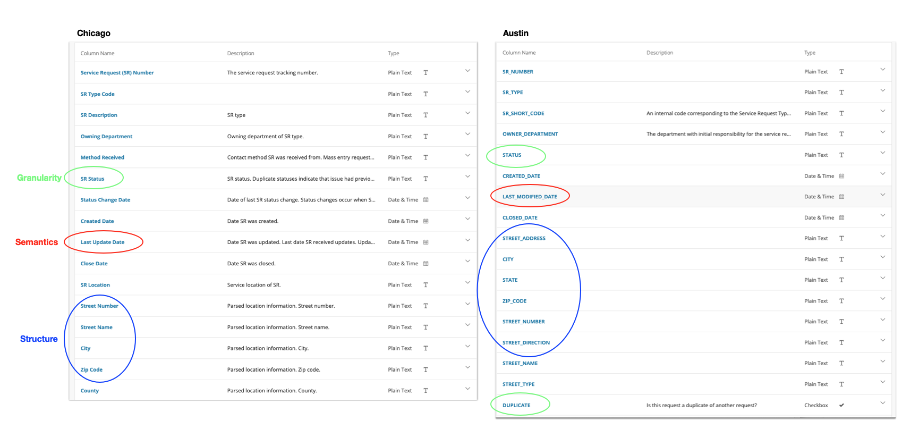

# Data Integration

## Chapter
The next four weeks of our class will focus on 'grand challenges' in data curation. A [grand challenge](https://en.wikipedia.org/wiki/Grand_Challenges) in this context is a problem that requires sustained research and development activities through collective action. Data integration, packaging, discovery, and meaningful descriptive documentation (metadata) are longstanding grand challenges that are approached through a community of practitioners and researchers in curation. This chapter focuses on data integration as it operates at the logical level of tables, and data that feed into user interfaces.

### Integration as a Grand Challenge

In the popular imagination, much of curation work is positioned as the activities necessary to prepare data for meaningful analysis and reuse. For example, when data scientists describe curation work they often say something to the effect of  "95% of data science is about wrangling / cleaning"

<blockquote class="twitter-tweet"><p lang="en" dir="ltr">Convert back and forth from JSON to Python dictionaries. <a href="https://t.co/AOFXuKWhm3">pic.twitter.com/AOFXuKWhm3</a></p>&mdash; Vicki Boykis (@vboykis) <a href="https://twitter.com/vboykis/status/1116862862755016704?ref_src=twsrc%5Etfw">April 13, 2019</a></blockquote> <script async src="https://platform.twitter.com/widgets.js" charset="utf-8"></script>

If there are only two things I am trying to actively argue against in this class it is this:

- Curation is not *just* cleaning or wrangling data. It includes the attendant practices of making data contextually meaningful. This includes a good deal of cleaning or wrangling, but is much broader in scope than simply preparing data for analysis.
- Metadata is not just "data about data". It is a complex and important knowledge organization activity that impacts nearly every aspect of data use. Every time someone says "metadata is just data about data" a tautology angel gets its wings.

In future weeks we will discuss practical ways to approach metadata and documentation that are inline with curation as an activity that goes beyond simply preparing data for analysis. This week however we are focused on conceptualizing and approaching the topic of data integration. The combining of datasets is a grand challenge for curation in part because of our expectations for how seemingly obvious this activity *should* be. Take a moment to consider this at a high level of abstraction: One of the spillover effects of increased openness in government, scientific, and private sector data practices is the availability of more and more structured data. The ability to combine and meaningfully incorporate different information, based on these structures, should be possible. For example:

- All municipalities have a fire department.
- All municipal fire departments have a jurisdictional mandate to proactively investigate fire code compliance.
- It follows, logically, that we should be able to use openly published structured data to look across jurisdictions and understand fire code compliance.

But, in practice this proves to be incredibly difficult. Each jurisdiction has a slightly different fire code, and each municipal fire department records their investigation of compliance in appreciably different ways. So when we approach a question like "fire code compliance" we have to not just clean data in order for it be combined, but think conceptually about the structural differences in datasets and how they might be integrated with one another.

### Enumerating data integration challenges

So, if structured data integration is intuitive conceptually, but in practice the ability to combine one or more data sources is incredibly difficult, then we should be able to generalize some of the problems that are encountered in this activity. Difficulties in data integration break down into, at least, the following:

1. **Content Semantics:** Different sectors, jurisdictions, or even domains of inquiry may refer to the same concept differently. In data tidying we discussed ways that data values and structures can be made consistent, but we didn't discuss the ways in which different tables might be combined when they represent the same concept differently.
2. **Data Structures or Encodings:** Even if the same concepts are present in a dataset, the data may be practically arranged or encoded in different ways. This may be as simple as variables being listed in a different order, but it may also mean that one dataset is published in `CSV` another in `JSON` and yet another in an `SQL` table export.
3. **Data Granularity:** The same concept may be present in a dataset, but it may have finer or coarser levels of granularity (e.g. One dataset may have monthly aggregates and another contains daily aggregates).

The curation tradeoff that we've discussed throughout both DC 1 and DC 2 in terms of "expressivity and tractability" is again rearing its head. In deciding how any one difficulty should be overcome we have to balance a need for retaining conceptual representations that are accurate and meaningful. In data integration, we have to be careful not go overboard in retaining an accurate representation of the same concept such that it fails to be meaningfully combined with another dataset.

Data Integration, as you might have inferred, is always a downstream curation activity. But, understanding challenges in data integration can also help with decisions that happen upstream in providing recommendations for how data can be initially recorded and documented such that it will be *amenable* to future integration.^[A small plug here for our opening chapter - when I described a curators need to "infrastructurally imagine" how data will be used and reused within a broader information system, upstream curation activities that forecast data integration challenges are very much what I meant.]

### Integration Precursors 

To overcome difficulties in combining different data tables we can engage with curation activities that I think of as 'integration precursors' - ways to conceptualize and investigate differences in two datasets before we begin restructuring, normalization, or cleaning. These integration precursors are related to 1. Modeling; 2. Observational depth; and, 3. Variable Homogeneity.

#### Modeling Table Content

The first activity in data integration is to informally or formally model the structure of a data table. In DC 1 we created data dictionaries which were focused on providing users of data a quick and precise overview of their contents. Data dictionaries are also a method for informally modeling the content of a dataset so that we, as curators, can make informed decisions about restructuring and cleaning.

Here is an example of two data dictionaries for the same conceptual information: 311 service requests of data from the city of [Chicago, IL](https://data.cityofchicago.org/Service-Requests/311-Service-Requests/v6vf-nfxy) and [Austin, TX](https://data.austintexas.gov/City-Government/311-Unified-Data-Test-Site-2019/i26j-ai4z). Intuitively, we would expect that data from these two cities are similar enough in conceptual content that they should be able to be meaningfully combined. Before even looking at the content we can assume there will be: 

1. A date
2. A report of some service outage or complaint
3. A location of the report or complaint, and 
4. The responsible city service that should respond.

The reality is much messier. 



Even though these two cities record the same information about the same concept using the same data infrastructure (each city publishes data using a Socrata-based data repository) there are appreciable differences and challenges in integrating these two datasets. The annotations above point out some of these slight but appreciable differences: 

- Granularity - We can see that the Chicago dataset represents a variable `SR_Status` that includes information about whether or not the request is open, as well as whether or not the request is a duplicate. The Austin dataset contains a similar variable `Status` but instead of also recording a duplicate here, there is a second variable `Duplicate` that contains this information. That is, the Austin dataset is more granular. If duplicate information were important to retain in our integrated dataset we would need to determine a way to tidy these variables or values.

- Semantics - Both datasets include information about the most recent update (response) to the request, but these are variables are labeled in slightly different ways - `Last_Update_Date` and `Last_Modified_Date` ... This should be a simple to tidy by renaming the data variable (but as we will see, this proves to be more more challenging than just renaming the variable).

- Structure - Both datasets also include location information about the report. However, there is both different granularity as well as a different ordering of these variables. To tidy this location information, we would need to determine which variables to retain and which to discard.

The process of modeling our data tables before integration facilitates making accurate decisions, but also creating a way for us to record those decisions and communicate them to end-users. A data dictionary, or a loose description of the contents of both tables, is often our first step in deciding which data cleaning activities we need to undertake for integrating data.

#### Determine the Observation Depth  

In integrating a two data tables there will likely be a difference in granularity that is specific to the depth or specificity of reported values. Most simply, this relates to how specific any one variable is recorded, and requires us as curators to make a decision about what specificity is necessary to retain or create in terms of our new combined, or integrated, dataset.

Imagine we have three tables` A`, `B`, and `C`. Each table contains the same variable `X`, but the values for `X` in each table have a different observational depth.  In comparing the values of this variable we could look across the three tables and see a difference in observation depth as follows:

| A-X | B-X | C-X |
|------|------|-----|
| 1 | 2 | 1.1|
| 1 | 2 | 4.7|
| 1 | 2 | 4.4|
| 1 | 2 | 3.0|

(Keep in mind - A, B and C represent the three different tables, and X represents the same variable found in all three datasets)

This example looks simple at face value, but will require an important decision for integration. Tables `A` and `B` both represent observational values of `X` as integers (whole numbers that are zero, negative, or positive). Table `C` represents the observational values of `X` as an irrational number.

Once we recognize this, our decision is simple - we can either convert the values in `A` and `B` to be irrational (1.0, 2.0, etc) or we can round the values in `C` to create integers. Regardless of our decision it is important to note that we are not just changing the values, but we are also changing their `encoding` - that is whether they represent integers or irrational numbers. We would need to document this change in our model.

Let's look at differences in observational depth from two variables in the 311 data described above.

| Created Date  	| Created Date            	|
|---------------	|-------------------------	|
| 4/20/20 10:14 	| 2020 Apr 20 10:58:34 AM 	|
| 4/20/20 10:14 	| 2020 Apr 20 10:57:21 AM 	|
| 4/20/20 10:14 	| 2020 Apr 20 10:54:04 AM 	|
| 4/20/20 10:14 	| 2020 Apr 20 10:52:39 AM 	|
| 4/20/20 10:14 	| 2020 Apr 20 10:52:17 AM 	|
| 4/20/20 10:14 	| 2020 Apr 20 10:46:53 AM 	|
| 4/20/20 10:14 	| 2020 Apr 20 10:46:29 AM 	|
| 4/20/20 10:14 	| 2020 Apr 20 10:43:44 AM 	|
| 4/20/20 10:14 	| 2020 Apr 20 10:43:35 AM 	|
| 4/20/20 10:13 	| 2020 Apr 20 10:43:29 AM 	|
| 4/20/20 10:13 	| 2020 Apr 20 10:41:31 AM 	|
| 4/20/20 10:13 	| 2020 Apr 20 10:40:38 AM 	|
| 4/20/20 10:13 	| 2020 Apr 20 10:40:28 AM 	|


Chicago represents time of a 311 report following a `MM-DD-YY HH:MM` form, while Austin represents this same information with `YYYY-MMM-DD HH:MM:SS 12HRM`

The observational depth is greater (has more granularity) in the Austin table. But, we also have some untidy representations of dates in both datasets. If we want to integrate these two tables then we have to decide 1. How to normalize the values; and, 2. Which depth of granularity to retain.

Regardless of how we decide to normalize this data, what we have to try to retain is a reliable reporting of the date such that the two sets of observations are homogenous. For example, the Chicago data don't include seconds for a 311 request creation. We can either add these are 00 values, or we can remove these from the Austin data. In either decision, we are changing the depth of granularity in our integrated table. (note, we also need to transform the hours so that they either represent a 24 hour cycle, or are marked by a 12HR marking such as `AM` or `PM`).

#### Determine Variable Homogeneity

The last integration precursor that we'll discuss has to do with the homogeneity of a variable. In modeling the two or more tables for potential integration we will seek to define and describe which variables are present, but we've not yet identified whether or not two variables can be reliably combined. To make this decision, we need to first determine the goals of the integration. Some general criteria to consider are as follows:

- Analysis and Computation - If we are optimizing data integration for easing analysis then we want high amount of homogeneity in the variables we will combine.
- Synthesis - If we are optimizing for a more general purpose, such as the ability to synthesize results from two different datasets, then we can likely afford to combine variables that may have less homogeneity
- Statistical Significance - A combination of synthesis and analysis criteria is what we plan to realistically produce by integrating a dataset. If we expect to create statistical summaries that require significant results (that is we will make some decision or generalization based on our statistical analysis) then it is of the utmost importance that the combined variables have high homogeneity. On the other hand, if all that we require is a rough sense of when or where an observation occurs then low homogeneity is acceptable.

An example of variable homogeneity will help make these points clear. Each table from Austin and Chicago contains a variable that roughly corresponds with the type of 311 request or report being made. In the Austin table this information is more granularly reported - there is code that is used internally `SR_Type_Code`, and a `Description` variable that provides a plain text explanation of the code. In the Chicago table there is simply a variable called `SR_Type`. If we pay attention closely to the values in these two tables we can determine that the `Description` and `SR_Type` are homogenous. That is, the Austin table and the Chicago table have similar information but use slightly different semantic values to control the variable.

| Description                         	| SR_Type                               	|
|-------------------------------------	|---------------------------------------	|
| Tree Issue ROW                      	| Aircraft Noise Complaint              	|
| ARR Missed Recycling                	| Vacant/Abandoned Building Complaint   	|
| Street Light Issue- Address         	| Tree Removal Request                  	|
| Found Animal Report - Keep          	| Sign Repair Request - All Other Signs 	|
| Dangerous/Vicious Dog Investigation 	| Rodent Baiting/Rat Complaint          	|
| Traffic Signal - Maintenance        	| Rodent Baiting/Rat Complaint          	|
| ARR Dead Animal Collection          	| Aircraft Noise Complaint              	|
| ARR Dead Animal Collection          	| Rodent Baiting/Rat Complaint          	|
| ARR Missed Yard Trimmings/Compost   	| Rodent Baiting/Rat Complaint          	|
| ARR Missed Yard Trimmings/Compost   	| Fly Dumping Complaint                 	|
| Animal Control - Assistance Request 	| Tree Debris Clean-Up Request          	|
| Street Light Issue- Address         	| Aircraft Noise Complaint              	|
| Street Light Issue- Address         	| Aircraft Noise Complaint              	|
| Street Light Issue- Address         	| Rodent Baiting/Rat Complaint          	|

Integrating these two variables in the same table seems possible, but we have a decision to make - we can either combine the two variables and leave the semantic value with low homogeneity, or we can create something like a controlled vocabulary for describing the type of 311 request being made and then clean the data so that each value is transformed to be compliant with our vocabulary. For example, `Street Light Issue - Address` in the Austin table, and `Sign Repair Request` both have to do with a report being made about public signage. We could create a broad category like `Public Signage` and then transform (that is, change the values) accordingly. But, we have only determined this step is possible by comparing the two variables directly. When we determine there is a variable homogeneity that matches our intended integration goal we can then take a curation action.  

### Horizontal and Vertical Table Integration
Thus far we've described precursors to integrating data tables. Once we've taken these steps we're left with the practical step of actually combining the two tables. Generally, there are two types of table integrations that can be made: Horizontal and Vertical Integration. In practice, combining tables is rather trivial based on the steps we've taken to prepare data for integration.

#### Horizontal data integration 

Horizontal data integration is necessary when we have the same set of observations, but multiple variables *scattered* across two tables. By performing a horizontal data integration we make the table *wider* by adding new variables for each observation. If you have any experience with databases this is also referred to as a **join**. To horizontally integrate data we perform `left_joins` or `right_joins`

To accurately perform a horizontal data integration manually - that is copying between two datasets - it is necessary to make sure that each dataset has a shared variable (you can copy one variable between the two datasets if they do not already share one) and then simply align the two variables to complete the integration.

I am also going to show you how how to perform a horizontal data integration using `R` ... You do not have to follow these steps unless you are interested. To follow along you should download and install [RStudio](https://rstudio.com/products/rstudio/download/) (select the RStudio Desktop free installation). These example comes from friends running the [Lost Stats](https://github.com/LOST-STATS) project.

```
# Install dplyr - a package in the tidyverse for restructuring data
install.packages('dplyr')

# Load the library by calling it in your terminal.
library(dplyr)

# The data we will use contains information on GDP in local currency
GDP2018 <- data.frame(Country = c("UK", "USA", "France"),
                  Currency = c("Pound", "Dollar", "Euro"),
                  GDPTrillions = c(2.1, 20.58, 2.78))

#To view the data we have just created follow the next step
View(GDP2018)

# Now we will create a second data set that contains dollar exchange rates
DollarValue2018 <- data.frame(Currency = c("Euro", "Pound", "Yen", "Dollar"),
                              InDollars = c(1.104, 1.256, .00926, 1))
```

To horizontally integrate this data we want to join or combine together `GDP2018` and `DollarValue2018`. In doing so we can also convert all the GDPs to dollars and compare them.

There are three kinds of observations we could get in this integration - observations in `GDP2018` but not `DollarValue2018`, observations in `DollarValue2018` but not `GDP2018`, and observations in **both**.

Use `help(join)` to see the types of joins that we can make in R.

The “Yen” observation won’t have a match in both datasets, so we don’t need to keep it. So let’s do a `left_join` and `list GDP2018` first, so it keeps matched observations, plus any observations only in `GDP2018`.

To complete our horizontal data integration we simply do the following:

```
GDPandExchange <- left_join(GDP2018, DollarValue2018)

#We have now horizontally integrated our two datasets. To view this integrated dataset do the following
View(GDPandExchange)
```

One helpful note about `R`, in this platform the `join` function will automatically detect that the `Currency` variable is shared in both data sets and use it to join them. When `R` detects this similarity, it simply retains just one example of the `Currency` variable. Voila!

#### Vertical data integration
Vertical data integration, which is much more common in curation, is when we have two  tables with the same variables, but different observations. To perform a vertical integration we simply add new observations to one of our existing datasets. This makes our integrated data table *longer* because it contains more observations.  

In `R` we first will subset a native dataset and then recombine it to see how vertical integration works in practice.

```
library(dplyr)

# Load in mtcars data - a dataset that is native to R
data(mtcars)

# Take a look at the dataset and see what we will be first splitting and then recombining
View(mtcars)

# Split the dataset in two, so we can combine these back together
mtcars1 <- mtcars[1:10,]
mtcars2 <- mtcars[11:32,]

#Our memory is now holding the two tables in its memory. If you want to check this try `View(mtcars1)`

# Use bind_rows to vertically combine the data sets
mtcarswhole <- bind_rows(mtcars1, mtcars2)

# The bind_rows command is simply concatenating or combing the two datsets one on top of the other.
# Now check to see the horizontally combined datasets
View(mtcarswhole)
```

These are the two most common integration tasks we will perform - integrating datasets with complimentary variables, and integrating datasets with new observations. 

The hard part about data integration, as should be obvious by now, is in evaluating and preparing data to be combined. Once we have thoroughly completed each of the different integration precursors our task for actually integrating tables is relatively simple.

### Summary
In this introduction to grand challenges in data curation we explored ways to prepare for and execute data integration at the table level. We first articulated a set of things that makes all data integration challenging:

1. Differences in semantic content
2. Differences in data structure and encoding
3. Differences in data granularity

To overcome these challenges I proposed a set of `integration precursors` that included:

1. Modeling data content
2. Determining Observation Depth
3. Determining Variable Homogeneity

Once these tasks were complete we looked at practical ways to combine two tables, including horizontal and vertical integrations.

## Lecture
Forthcoming

## Readings
Data integration is a topic that can be incredibly complex, and much of the published literature fails to make this an approachable or even realistic read for a course like DC II. So, you get somewhat of a pass on readings this week. 

Please read this blog post for discussion (if you chose) on the Canvas forum: 

- Whong, Chris (2020) "Taming the MTA’s Unruly Turnstile Data" [Medium]( https://medium.com/qri-io/taming-the-mtas-unruly-turnstile-data-c945f5f96ba0)

Let me also make a plug for the Wikipedia article on [data integration](https://en.wikipedia.org/wiki/Data_integration) - this is a phenomenal overview that should compliment my writing above.

If you are interested in the history of this topic from the perspective of databases I also highly recommend the following:

- Halevy, A., Rajaraman, A., & Ordille, J. (2006, September). Data integration: The teenage years. In Proceedings of the 32nd international conference on Very large data bases (pp. 9-16). [PDF](https://www.cin.ufpe.br/~if696/referencias/integracao/_Data_Integration-The_Teenage_Years.pdf)

For a bit of historical background, Ch 1 of this book (pages 1-13) provides an excellent overview of how data were originally made compliant with web standards:

- Abiteboul, S., Buneman, P., & Suciu, D. (2000). Data on the Web: from relations to semistructured data and XML. Morgan Kaufmann. [PDF](https://homepages.dcc.ufmg.br/~laender/material/Data-on-the-Web-Skeleton.pdf)

## Exercise
The exercise this week comes from an interesting analysis of New York City 311 data by [Chris Whong](https://t.co/J7X3FMUvQc?amp=1). What he observes is a 1000% increase in "Consumer Complaint" 311 requests since the first recorded case of Covid-19 infection in NYC. This is not without some important external conditions - After this recorded infection there was a more concerted effort by NYC residents to stockpile supplies. Having heard numerous informal complaints of price-gouging the city recommended that consumers report businesses using a 311 hotline.

A simple graph makes this more compelling than the narrative description - we see a huge spike in complaints beginning March 1st.


As savvy data curators, we might ask whether or not this trend holds across cities throughout the USA.  And at its core, this is a data integration challenge. If we can find other city's 311 data we should be able to reliably compare rates of 311 complaints over time. The challenge will be finding data that has the same kinds of variables, and normalizing values to have a one to one comparison between cities.

Lucky for us, there is an existing repository of [311 city data](https://andrew-friedman.github.io/jkan/datasets/).

Your exercise this week is to choose two cities from this repository and attempt to integrate a subset of their data. This will be challenging. 

**Here are some helpful pointers:**

- Choose cities that have "up-to-date" data (marked by "current" in the title)
- Subset this data so that it only includes 311 complains from March 1, 2020 forward. You can often subset data in a repository by choosing to view and filter the data first. Here is an example from [Chicago's open data portal](https://data.cityofchicago.org/Service-Requests/311-Service-Requests/v6vf-nfxy/data) (note just select filter in this interface)
- Once you have subsetted the tables for your two cities, try to eliminate any unnecessary variables from your dataset. That is - we don't need all of the information about the data - we only need a record of, for example, the complaint and the date.

**What to turn in:**

- Provide us a table of your data from two cities (a Google Sheet or Excel document is fine). If you are able to integrate the data, provide just one sheet. If you cannot - give us two separate sheets. Note - this will be challenging to do. If you spend an hour trying to integrate the two datasets and up hating me (and this class) that is completely acceptable, but make an attempt and then follow the next step. 
- Provide an explanation (~1 paragraph) of which cities you selected, what you tried to integrate the data, and why this was or was not challenging.
- You do not need to create a graph or any form of analysis - but if you do it would be very interesting to see your results!

